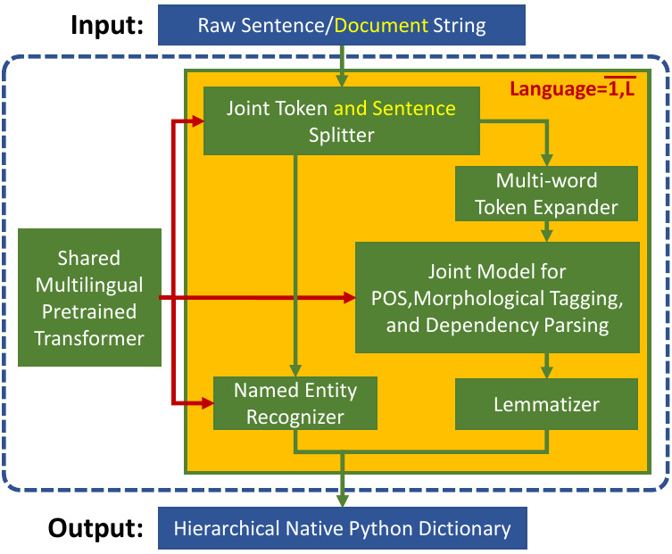

How Trankit works
=================

*Note: The best way to understand how Trankit works is to look at our technical paper, which is available at*: https://arxiv.org/

In this section, we briefly present the most important details of the technologies used by Trankit.

Natural Language Processing (NLP) pipelines of prior NLP Toolkits such as UDPipe (`Straka, 2018 <hhttps://www.aclweb.org/anthology/K18-2020/>`_) and Stanza (`Qi et al., 2013 <https://arxiv.org/pdf/2003.07082.pdf>`_) are trained separately and do not share any component, especially the embedding layers that account for most of the model size. This makes their memory usage grow aggressively as pipelines for more languages are simultaneously needed and loaded into the GPU memory. Most importantly, *none of such toolkits have explored contextualized embeddings from pretrained transformer-based language models* that have the potentials to significantly improve the performance of the NLP tasks, as demonstrated in many prior works (`Devlin et al., 2018 <https://arxiv.org/abs/1810.04805>`_, `Liu et al., 2019b <https://arxiv.org/abs/1907.11692>`_, `Conneau et al., 2020 <https://arxiv.org/abs/1911.02116>`_). This motivates us to develop Trankit that can overcome such limitations.

    Overall architecture of Trankit. Among the five models, three (i.e., Token and Sentence Splitter, Joint Model, and Named Entity Recognizer) in Trankit are transformer-based. They all share a single multilingual pretrained transformer.

First, we utilize the state-of-the-art multilingual pretrained transformer XLM-R to build three components: the Joint Token and Sentence Splitter; the Joint Model for part-of-speech, morphological tagging, and dependency parsing; and the Named Entity Recognizer (See the figure above). As a result, our system advances state-of-theart performance for sentence segmentation, part-of-speech (POS) tagging, morphological feature tagging, and dependency parsing while achieving competitive or better performance for tokenization, multi-word token expansion, and lemmatizatio over the 90 treebanks.

Second, we simultaneously solve the problem of loading pipelines for many languages into the memory and the problem of the transformer size with our novel plug-and-play mechanism with the Adapters (`Pfeiffer et al., 2020a <https://arxiv.org/abs/2005.00247>`_, `Pfeiffer et al., 2020b <https://arxiv.org/abs/2007.07779>`_). In particular, a set of adapters (for transfomer layers) and task-specific weights (for final predictions) are created for each transformerbased component for each language while only one single large multilingual pretrained transformer is shared across components and languages. During training, the shared pretrained transformer is fixed while only the adapters and task-specific weights are updated. At inference time, depending on the language of the input text and the current active component, the corresponding trained adapter and task-specific weights are activated and plugged into the pipeline to process the input. This mechanism not only solves the memory problem but also substantially reduces the training time.

